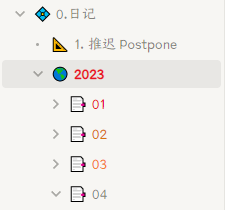

这里存放我基于 @zuoez02 大佬的[插件系统](https://github.com/zuoez02/siyuan-plugin-system)开发的插件

请通过插件系统安装。

## 彩色文件树 color-folder

给文件夹添加颜色！

#### 已知问题

因为我没找到方法区分文件树菜单和其他菜单，所以在其他地方也有可能看到`修改颜色`功能，现阶段只能忽略一下，点击不会造成任何后果。

## 多屏协作防偷窥 hide-content-when-unfocused

窗口失去焦点时隐藏笔记内容

## License

[MIT](./LICENSE) License © 2023 [Mux](https://github.com/InEase)